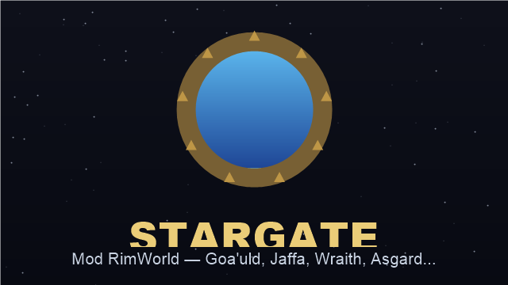

# Stargate — Mod RimWorld 1.6



Un mod qui apporte l'univers de **Stargate** dans RimWorld : races, équipement, factions, idéologie, et (à venir) vaisseaux et quêtes.

> **DLC requis :** Biotech, Ideology, Odyssey · **RimWorld 1.6**

## Contenu

- **8 races jouables** (xénotypes) : Tau'ri, Jaffa, Goa'uld, Reine Goa'uld, Tok'ra, Asgard, Unas, Wraith.
- **Cycle de vie du symbiote Goa'uld** : larves fragiles, implantation dans les Jaffa, maturation, prise de contrôle d'un hôte, reine pondeuse.
- **Armes** : bâton jaffa, zat'nik'tel, kara kesh.
- **Équipement** : armure et casque de garde serpent, parure goa'uld, uniforme du SGC.
- **Bâtiments & ressources** : sarcophage régénérateur, naquadah, arbre de recherche Stargate.
- **Faction** hostile des Grands Maîtres Goa'uld et de leurs Jaffa.
- **Idéologie** : culte des Goa'uld.

### En développement
Vaisseaux (gravships) par race, armes de vaisseau, système de quêtes vers une cité légendaire.

> ℹ️ Les textures sont pour l'instant des **placeholders** réutilisant des assets vanilla ; l'art dédié viendra.

## Installation

1. Télécharger la dernière [release](../../releases) et extraire le dossier dans `RimWorld/Mods/`.
2. Activer **Stargate** dans la liste des mods (après les DLC).

## Compiler depuis les sources

Le dépôt **est** le mod. Le code C# est dans `Source/` (non lu par RimWorld).

```
dotnet build Source/Stargate/Stargate.csproj -c Release
```
Le DLL est généré dans `Assemblies/Stargate.dll`.

## Structure
```
About/        métadonnées du mod
Defs/         contenu XML (races, armes, factions, recherche…)
Assemblies/   DLL compilée
Source/       code C# + .csproj (non livré au jeu)
```
