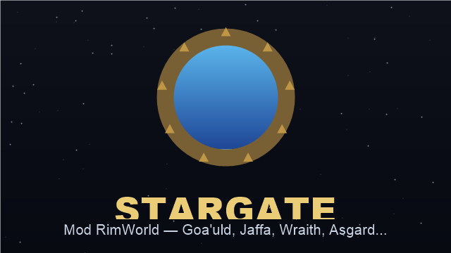

# Stargate — Mod RimWorld 1.6



Un mod qui apporte l'univers de **Stargate** dans RimWorld : races, symbiotes, équipement, factions, vaisseaux et la Porte des étoiles.

> **DLC requis :** Biotech, Ideology, Odyssey · **RimWorld 1.6**
> **Mods requis :** [Harmony](https://steamcommunity.com/sharedfiles/filedetails/?id=2009463077), [Vanilla Expanded Framework](https://steamcommunity.com/sharedfiles/filedetails/?id=2023507013), [Vanilla Gravship Expanded – Chapter 1](https://steamcommunity.com/sharedfiles/filedetails/?id=3609835606), [Vanilla Gravship Expanded – Chapter 2](https://steamcommunity.com/sharedfiles/filedetails/?id=3799737423)

## Contenu

- **8 races jouables** (xénotypes) : Tau'ri, Jaffa, Goa'uld, Reine Goa'uld, Tok'ra, Asgard, Unas, Wraith.
- **Cycle de vie du symbiote Goa'uld** : larves fragiles, implantation dans les Jaffa, maturation, prise de contrôle d'un hôte, reines pondeuses. Les Jaffa **dépendent** de leur larve… ou de la **tretonine**.
- **Armes** : bâton jaffa, kara kesh, **zat'nik'tel fidèle** (un tir assomme, deux tirs tuent, IEM contre les machines).
- **Équipement** : armure et casque de garde serpent, parure goa'uld, uniforme du SGC.
- **Naquadah** : minerai, matériau métallique, carburant ; **générateur au naquadah**.
- **Bâtiments** : sarcophage régénérateur, **anneaux de transport**, **Porte des étoiles + DHD** (exploration de mondes lointains).
- **Factions** : Grands Maîtres goa'uld (hostiles), **Commandement Stargate**, **Tok'ra**, **Jaffa libres**, **Asgard** — avec leurs marchands.
- **Gravships (Vanilla Gravship Expanded)** : canon à plasma goa'uld, canon à ions asgard, bouclier goa'uld, blindage en naquadah, et la menace orbitale du **Ha'tak goa'uld**.
- **Recherche** : onglet Stargate + technologies de vaisseau dans l'onglet Gravtech.
- **Idéologie** : culte des Goa'uld.

### En développement
Système de quêtes via la Porte des étoiles jusqu'à la cité des Anciens ; art dédié.

> ℹ️ Les textures sont pour l'instant des **placeholders** (assets vanilla/VGE teintés, icônes générées par code) ; l'art dédié viendra (prompts : `Art/PROMPTS_MISTRAL.md`).

## Installation

1. Télécharger la dernière [release](../../releases) et extraire le dossier dans `RimWorld/Mods/`.
2. Activer **Stargate** dans la liste des mods (après les DLC, Harmony, Vanilla Expanded Framework et Vanilla Gravship Expanded).

## Compiler depuis les sources

Le dépôt **est** le mod. Le code C# est dans `Source/` (non lu par RimWorld). Il se compile contre
les DLL de RimWorld (paquet NuGet) et celles de VEF / VGE, lues par défaut dans le dossier Workshop
de Steam (`C:\Program Files (x86)\Steam\steamapps\workshop\content\294100`) :

```
dotnet build Source/Stargate/Stargate.csproj -c Release
dotnet build Source/Stargate/Stargate.csproj -c Release -p:WorkshopDir="D:\SteamLibrary\steamapps\workshop\content\294100"
```
Le DLL est généré dans `Assemblies/Stargate.dll` (les DLL VEF/VGE ne sont jamais copiées).

Outils de développement (validation des Defs sans lancer le jeu, génération du plan du Ha'tak et
des textures provisoires) : voir `Tools/README.md`.

## Structure
```
About/        métadonnées du mod
Defs/         contenu XML (races, armes, factions, vaisseaux, recherche…)
Languages/    traductions (français, anglais)
Textures/     textures propres au mod (placeholders générés pour l'instant)
Assemblies/   DLL compilée
Source/       code C# + .csproj (non livré au jeu)
Tools/        outils de dev : validateur de Defs, générateurs (non lus par le jeu)
Art/          prompts de génération des assets
```
